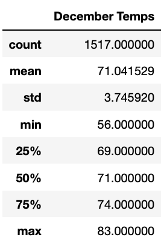
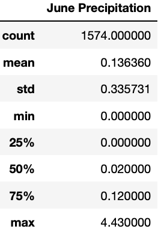
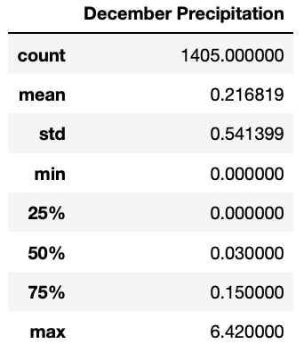

# surfs_up
Week 9 Module 9

## Overview: 

The purpose of this analysis was to continue to provide research and insights on the weather of the island Oahu for months June and December to help W. Avy determine if the surf and ice cream shop business is sustainable year-round. This was accomplished by looking into the statistical analysis of the two months requested and comparing the results for W. Avy.  

## Results: 

There are three main differences between the June and December temperature statistics:  

* June’s average temperature is slightly higher at about 75 degress compared to December’s 71 degree average.  
* The minimum temperature in December is 8 degrees lower than June’s lowest 56 and 64 respectively.  
* 25% of Decembers’ temperatures were under 70 degrees which is four degress lower than June’s 73 lower percentile.  

  

  

## Summary:  

There is a high-level summary of the results and there are two additional queries to perform to gather more weather data for June and December.  

  

  
