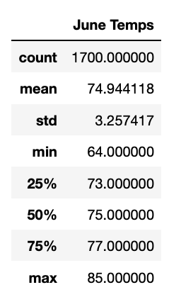

# surfs_up
Week 9 Module 9

## Overview: 

The purpose of this analysis was to continue to provide research and insights on the weather of the island Oahu for months June and December to help W. Avy determine if the surf and ice cream shop business is sustainable year-round. This was accomplished by looking into the statistical analysis of the two months requested and comparing the results for W. Avy.  

## Results: 

There are three main differences between the June and December temperature statistics:  

* June’s average temperature is slightly higher at about 75° compared to December’s 71° average.  
* The minimum temperature in December is 8° lower than June’s lowest, 56° and 64° respectively.  
* 25% of Decembers’ temperatures were under 70° which is four degrees lower than June’s 73°.  

 

  

## Summary:  

Overall the data suggest that while December may have more days with lower temperatures, it does not appear that would result in a non-profitable month for the ice cream and surf shop during December especially if the maximum temperature 84° is taken into account. Another fact supporting the business is that over half of the December temperatures are over 70°.

In order to gather more data, I also took a look at precipitation for the months of June and December. For both months, the average rain fall and the 75th percentile was less than half an inch.  Where the two months did differ was on the max amount of rainfall which was 4.4 inches for June and 6.4 inches for December. From this analysis it would be safe to conclude that neither June or December has much rainfall, but between the two months, the heaviest rainfall day will most likely be in December.  

  

  
